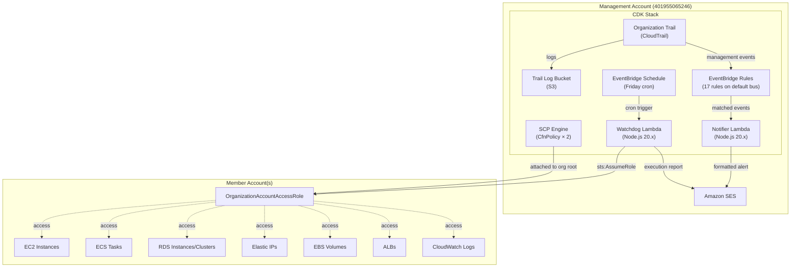

# Design Document: org-security-controls

## Overview

This design describes an AWS CDK (TypeScript) stack that deploys an organization-level security and cost-control system across three pillars:

1. **Service Control Policies (SCPs)** — Preventive guardrails attached to the organization root, enforcing region restriction, instance class/type limits, audit protection, identity controls, and MFA enforcement.
2. **Organization CloudTrail + EventBridge Notifier** — An organization-level trail delivering management events to the default EventBridge bus, where precise rules route specific security events to a single Lambda that formats and sends SES email alerts.
3. **Watchdog Lambda** — A weekly-scheduled Lambda that assumes into each member account, stops idle compute/database resources, releases unused EIPs, enforces log retention, reports wasted resources, and emails a structured execution summary.

The stack deploys entirely in the management account (401955065246) and uses the `OrganizationAccountAccessRole` for cross-account operations into member account(s) (e.g., 743602823695).

### Design Decisions

| Decision | Rationale |
|----------|-----------|
| Single CDK stack | All resources are management-account scoped; no cross-account CDK deployment needed |
| `CfnPolicy` for SCPs | CDK's L2 Organizations constructs are limited; `CfnPolicy` gives full control over policy JSON |
| Bundled DenyServices SCP | Organizations limits SCPs per target; bundling 7 deny statements into one policy conserves quota |
| Separate EnforceMFA SCP | Distinct policy for MFA enforcement keeps logic isolated and allows independent attachment |
| One EventBridge rule per event type | Cost minimization — Lambda only invoked for matching events; no post-invocation filtering |
| Single Notifier Lambda with formatters | Centralizes notification logic; formatters are pure functions selected by event type |
| SES-only delivery | No Slack integration required; SES is lowest-cost, simplest path |
| Watchdog uses Organizations ListAccounts | Dynamically discovers member accounts; no hardcoded account list |
| Node.js 20.x runtime for Lambdas | LTS, matches CDK TypeScript ecosystem, good AWS SDK v3 support |

## Architecture



### Data Flow

1. **SCP Enforcement**: SCPs are attached to the organization root at deploy time. AWS evaluates them on every API call in member accounts.
2. **Real-time Notifications**: CloudTrail → default EventBridge bus → matching rule → Notifier Lambda → SES email.
3. **Weekly Cost Control**: EventBridge Schedule → Watchdog Lambda → AssumeRole into each member account → enumerate & act → SES execution report.

## Components and Interfaces

### 1. SCP Engine (`lib/scp-engine.ts`)

A CDK Construct that builds and deploys two SCP policies.

```typescript
interface ScpEngineProps {
  approvedRegions: string[];              // e.g. ['eu-west-1', 'eu-west-3', 'eu-central-1', 'us-east-1']
  allowedRdsClasses: string[];            // e.g. ['db.t3.micro', 'db.t3.small', 'db.t4g.micro', 'db.t4g.small']
  allowedEc2Types: string[];              // e.g. ['t4g.nano', 't4g.micro']
  bedrockAllowedPrincipals: string[];     // 0-20 ARN patterns
  breakGlassRoleArn?: string;             // Optional CloudTrail break-glass exclusion
  organizationRootId: string;             // Target for policy attachment
}
```

**Responsibilities:**
- Build the DenyServices policy document (7 statements, unique Sids)
- Validate combined policy ≤ 5120 characters at synthesis time
- Build the EnforceMFA policy document
- Create `CfnPolicy` resources and attach to organization root

**Validation Logic (synthesis-time):**
- If `approvedRegions` is empty → throw synthesis error
- If serialized DenyServices JSON > 5120 chars → throw synthesis error with current size

### 2. Organization Trail (`lib/org-trail.ts`)

A CDK Construct wrapping the organization-level CloudTrail trail and its S3 bucket.

```typescript
interface OrgTrailProps {
  organizationId: string;           // e.g. 'o-lzfhtgvhr7'
  trailName?: string;               // default: 'OrgSecurityTrail'
}
```

**Responsibilities:**
- Create S3 bucket with organization-wide CloudTrail write policy
- Create organization trail with `IsOrganizationTrail: true`, `IsMultiRegionTrail: true`
- Enable management event capture (read + write)
- EventBridge integration is automatic when management events are captured on a trail

### 3. EventBridge Rules (`lib/eventbridge-rules.ts`)

A CDK Construct defining 17 EventBridge rules on the default bus.

```typescript
interface EventBridgeRulesProps {
  notifierLambda: lambda.IFunction;   // Target for all rules
}
```

**Responsibilities:**
- Define one `events.Rule` per event pattern with explicit `source`, `detailType`, and `detail` matching
- Configure dead-letter retry (3 attempts, 24h retention)
- Grant invoke permission on the Notifier Lambda for each rule

**Event Patterns:**

| Rule Name | Source | Detail-Type | Detail Match |
|-----------|--------|-------------|--------------|
| RootConsoleLogin | aws.signin | AWS Console Sign In via CloudTrail | `eventName: ConsoleLogin`, `userIdentity.type: Root` |
| ConsoleLoginNoMFA | aws.signin | AWS Console Sign In via CloudTrail | `eventName: ConsoleLogin`, `additionalEventData.MFAUsed: No` |
| LoginFailure | aws.signin | AWS Console Sign In via CloudTrail | `eventName: ConsoleLogin`, `responseElements.ConsoleLogin: Failure` |
| CloudTrailStopLogging | aws.cloudtrail | AWS API Call via CloudTrail | `eventName: StopLogging` |
| CloudTrailDeleteTrail | aws.cloudtrail | AWS API Call via CloudTrail | `eventName: DeleteTrail` |
| CloudTrailUpdateTrail | aws.cloudtrail | AWS API Call via CloudTrail | `eventName: UpdateTrail` |
| CloudTrailPutEventSelectors | aws.cloudtrail | AWS API Call via CloudTrail | `eventName: PutEventSelectors` |
| IamUserCreated | aws.iam | AWS API Call via CloudTrail | `eventName: CreateUser` |
| AccessKeyCreated | aws.iam | AWS API Call via CloudTrail | `eventName: CreateAccessKey` |
| LoginProfileAttached | aws.iam | AWS API Call via CloudTrail | `eventName: CreateLoginProfile` |
| MfaDeviceDeactivated | aws.iam | AWS API Call via CloudTrail | `eventName: DeactivateMFADevice` |
| SsoUserCreated | aws.sso-directory | AWS API Call via CloudTrail | `eventName: CreateUser` |
| SecurityGroupIngressOpened | aws.ec2 | AWS API Call via CloudTrail | `eventName: AuthorizeSecurityGroupIngress` |
| CostAnomalyDetected | aws.ce | AWS Cost Anomaly Detection Alert | (no detail filter) |
| BudgetThresholdBreached | aws.budgets | Budget Notification | (no detail filter) |
| AccessAnalyzerFinding | aws.access-analyzer | Access Analyzer Finding | (no detail filter) |
| OrganizationEvent | aws.organizations | AWS API Call via CloudTrail | (any organizations API call) |

### 4. Notifier Lambda (`lambda/notifier/`)

```typescript
// Handler signature
export const handler = async (event: EventBridgeEvent): Promise<void>

// Formatter interface
interface Formatter {
  canHandle(event: EventBridgeEvent): boolean;
  format(event: EventBridgeEvent): EmailMessage;
}

interface EmailMessage {
  subject: string;
  body: string;   // HTML formatted
}
```

**Responsibilities:**
- Receive event from EventBridge
- Select formatter based on `source` + `detail.eventName`
- Format human-readable alert (subject + HTML body)
- Send via SES (`ses:SendEmail`)
- Log errors on delivery failure

**Environment Variables:**
- `RECIPIENT_EMAIL` — SES recipient address
- `SENDER_EMAIL` — SES verified sender address

### 5. Watchdog Lambda (`lambda/watchdog/`)

```typescript
// Handler signature
export const handler = async (event: ScheduledEvent): Promise<void>

// Per-account execution result
interface AccountResult {
  accountId: string;
  accountName: string;
  roleAssumptionSuccess: boolean;
  regions: RegionResult[];
}

interface RegionResult {
  region: string;
  ec2Stopped: string[];
  ecsTasksStopped: string[];
  rdsInstancesStopped: string[];
  rdsClusterstopped: string[];
  eipsReleased: string[];
  logGroupsUpdated: string[];
  unusedEbsVolumes: VolumeInfo[];
  emptyAlbs: AlbInfo[];
  errors: string[];
}

interface VolumeInfo {
  volumeId: string;
  sizeGiB: number;
  region: string;
}

interface AlbInfo {
  albName: string;
  albArn: string;
  region: string;
}
```

**Responsibilities:**
- List member accounts via Organizations API
- Assume `OrganizationAccountAccessRole` in each member account (3600s session)
- For each account × each approved region:
  - Stop running EC2 instances
  - Stop running ECS tasks
  - Stop available RDS instances and Aurora clusters
  - Release unattached EIPs
  - Report available EBS volumes
  - Report empty ALBs (no registered targets)
  - Set 30-day retention on log groups without a policy
- Compile structured execution report
- Send report via SES

**Environment Variables:**
- `RECIPIENT_EMAIL` — SES recipient address
- `SENDER_EMAIL` — SES verified sender address
- `APPROVED_REGIONS` — Comma-separated list of regions to scan
- `CROSS_ACCOUNT_ROLE_NAME` — Role name to assume (default: `OrganizationAccountAccessRole`)

## Data Models

### SCP Policy Document Schema

```typescript
interface ScpPolicyDocument {
  Version: '2012-10-17';
  Statement: ScpStatement[];
}

interface ScpStatement {
  Sid: string;
  Effect: 'Deny';
  Action: string | string[];
  Resource: string;
  Condition?: Record<string, Record<string, string | string[] | boolean>>;
}
```

**DenyServices Statement Sids:**
1. `DenyOutsideApprovedRegions`
2. `DenyUnapprovedRdsClasses`
3. `DenyExpensiveEc2Types`
4. `DenyCloudTrailTampering`
5. `DenyRootUserActions`
6. `DenyIamUserCreation`
7. `DenyBedrockUnauthorized`

### EventBridge Event Schema (CloudTrail management event)

```typescript
interface CloudTrailEventBridgeEvent {
  version: '0';
  id: string;
  source: string;              // e.g. 'aws.iam'
  account: string;
  time: string;                // ISO 8601
  region: string;
  'detail-type': string;       // e.g. 'AWS API Call via CloudTrail'
  detail: {
    eventVersion: string;
    eventSource: string;
    eventName: string;
    awsRegion: string;
    sourceIPAddress: string;
    userAgent: string;
    userIdentity: {
      type: string;
      principalId: string;
      arn: string;
      accountId: string;
    };
    requestParameters: Record<string, unknown>;
    responseElements: Record<string, unknown>;
    [key: string]: unknown;
  };
}
```

### Watchdog Execution Report Schema

```typescript
interface ExecutionReport {
  executionTime: string;        // ISO 8601
  totalAccounts: number;
  processedAccounts: number;
  failedAccounts: FailedAccount[];
  accountResults: AccountSummary[];
}

interface FailedAccount {
  accountId: string;
  accountName: string;
  error: string;
}

interface AccountSummary {
  accountId: string;
  accountName: string;
  ec2StoppedCount: number;
  ecsTasksStoppedCount: number;
  rdsInstancesStoppedCount: number;
  rdsClustersstoppedCount: number;
  eipsReleasedCount: number;
  logGroupsUpdatedCount: number;
  unusedEbsVolumes: VolumeInfo[];
  emptyAlbs: AlbInfo[];
  errors: string[];
}
```

## Correctness Properties

*A property is a characteristic or behavior that should hold true across all valid executions of a system — essentially, a formal statement about what the system should do. Properties serve as the bridge between human-readable specifications and machine-verifiable correctness guarantees.*

### Property 1: SCP Policy Construction Correctness

*For any* valid `ScpEngineProps` (non-empty approved regions, any allowed RDS classes list, any blocked EC2 type patterns, any Bedrock allowlist of 0-20 entries, any optional break-glass role ARN), the `buildDenyServicesPolicy()` function SHALL produce a valid IAM policy document with `Version: "2012-10-17"` and a `Statement` array of exactly 7 deny statements, each with a unique `Sid`, where:
- The region restriction statement's condition references exactly the input `approvedRegions`
- The RDS statement's condition references exactly the input `allowedRdsClasses`
- The EC2 statement's condition references exactly the input `blockedEc2TypePatterns`
- The Bedrock statement's condition references the input `bedrockAllowedPrincipals` (or omits the ArnNotLike condition when the list is empty)
- The CloudTrail statement includes the break-glass exclusion condition if and only if `breakGlassRoleArn` is provided

**Validates: Requirements 1.1, 2.1, 3.1, 4.3, 7.1, 8.1, 8.4**

### Property 2: SCP Size Validation

*For any* valid `ScpEngineProps`, if the JSON-serialized DenyServices policy document exceeds 5120 characters then `buildDenyServicesPolicy()` SHALL raise a synthesis-time error; if it is ≤ 5120 characters then no error SHALL be raised.

**Validates: Requirements 8.2**

### Property 3: Formatter Selection Correctness

*For any* EventBridge event with a known `source` and `detail.eventName` combination that matches one of the 17 configured event types, the Notifier Lambda's formatter selection logic SHALL return the formatter whose `canHandle()` method returns true for that specific event type, and no other formatter SHALL claim to handle it.

**Validates: Requirements 12.1, 13.1**

### Property 4: Formatted Message Completeness

*For any* EventBridge event processed by any formatter, the resulting `EmailMessage` body SHALL contain the event source, the event timestamp, the affected AWS account ID, the acting principal ARN, and at least one event-specific detail field.

**Validates: Requirements 13.2**

### Property 5: Management Account Exclusion

*For any* list of AWS accounts returned by `Organizations.listAccounts()` that includes the management account (401955065246), the Watchdog Lambda's account filtering logic SHALL return a list that excludes the management account while preserving all other accounts in their original order.

**Validates: Requirements 15.1**

### Property 6: Session Duration Constraint

*For any* requested session duration value, the Watchdog Lambda's role assumption logic SHALL accept exactly 3600 seconds and SHALL reject any value greater than 3600 seconds before calling `sts:AssumeRole`.

**Validates: Requirements 15.2**

### Property 7: EIP Release Filtering

*For any* set of Elastic IP address descriptions, the Watchdog Lambda SHALL release if and only if the EIP has no associated network interface (i.e., `AssociationId` is absent or `NetworkInterfaceId` is absent), and SHALL never release an EIP that is currently associated.

**Validates: Requirements 18.2**

### Property 8: Resource Waste Identification

*For any* set of EBS volume descriptions, the Watchdog Lambda SHALL report exactly those volumes whose state is `"available"` (unattached). *For any* set of ALB descriptions with their target groups, the Watchdog Lambda SHALL report exactly those ALBs where every target group has zero registered targets.

**Validates: Requirements 19.1, 19.2**

### Property 9: Report Entry Field Completeness

*For any* reported unused EBS volume, the report entry SHALL contain the volume identifier, size in GiB, account ID, and region. *For any* reported empty ALB, the report entry SHALL contain the ALB name, account ID, and region.

**Validates: Requirements 19.3, 19.4**

### Property 10: Log Group Retention Enforcement Logic

*For any* set of CloudWatch log groups, the Watchdog Lambda SHALL call `putRetentionPolicy` with 30 days if and only if the log group's `retentionInDays` field is absent (undefined/null). Log groups with any existing retention value (regardless of the value) SHALL never have `putRetentionPolicy` called.

**Validates: Requirements 20.2, 20.3**

### Property 11: Execution Report Compilation Correctness

*For any* set of `AccountResult` objects (including accounts where role assumption failed), the compiled `ExecutionReport` SHALL accurately reflect: the total count of processed accounts, per-account/per-region counts that match the sum of individual action arrays, the complete list of failed accounts with their error messages, and all resource entries (EBS volumes, ALBs) present in the input results.

**Validates: Requirements 21.1, 21.2, 21.5**

## Error Handling

### SCP Engine Errors

| Error Condition | Handling Strategy |
|-----------------|-------------------|
| Empty `approvedRegions` | Throw synthesis-time error: "At least 1 approved region must be specified" |
| DenyServices policy > 5120 chars | Throw synthesis-time error: "DenyServices policy is {n} characters, exceeds 5120 character maximum" |
| Invalid ARN pattern in Bedrock allowlist | Let CDK/CloudFormation validate at deploy time |

### Notifier Lambda Errors

| Error Condition | Handling Strategy |
|-----------------|-------------------|
| Missing `RECIPIENT_EMAIL` env var | Log error with message "Missing RECIPIENT_EMAIL configuration", skip SES delivery, return without throwing |
| SES delivery failure | Log error including event type, timestamp, and failure reason; do not retry (EventBridge handles retries) |
| Unknown event type | Use generic formatter with raw JSON; do not throw |
| Malformed event payload | Log warning, attempt best-effort formatting with available fields |

### Watchdog Lambda Errors

| Error Condition | Handling Strategy |
|-----------------|-------------------|
| Role assumption failure | Log `{ accountId, error }`, mark account as failed, continue to next account |
| Individual EC2/ECS/RDS stop failure | Log `{ resourceId, region, error }`, continue processing remaining resources |
| EIP release failure | Log `{ allocationId, region, error }`, continue |
| EBS/ALB enumeration failure | Log `{ region, error }`, continue to next region |
| Log group retention set failure | Log `{ logGroupName, region, error }`, continue |
| SES report delivery failure (explicit failure) | Log failure details including error message |
| SES report delivery pending | Do not log as failure; treat as success |
| Organizations ListAccounts failure | Log error, abort execution (no accounts to process) |

### Retry Strategy

- **EventBridge → Notifier Lambda**: 3 retries over 24 hours (configured at rule level)
- **Watchdog Lambda internal operations**: No automatic retry; failures are logged and reported. The weekly schedule provides natural retry cadence.
- **STS AssumeRole**: No retry; failure is logged and account is skipped

## Testing Strategy

### Unit Tests (Example-Based)

Unit tests cover specific examples, edge cases, and integration points:

- **SCP Engine**: Verify exact policy JSON for known configurations; test empty regions error; test 5120-char boundary; test EnforceMFA policy structure
- **EventBridge Rules**: CDK assertion tests verifying 17 rules exist with correct patterns, targets, and retry config
- **Organization Trail**: CDK assertion tests for trail, bucket, and policy configuration
- **Notifier Lambda**: Test each of the 17 formatters with example events; test generic fallback; test missing env var handling
- **Watchdog Lambda**: Test individual action functions with mocked AWS SDK responses; test error resilience (one failure doesn't stop others)

### Property-Based Tests

Property-based tests verify universal correctness guarantees using [fast-check](https://github.com/dubzzz/fast-check) (TypeScript PBT library):

- **Minimum 100 iterations per property test**
- **Each test tagged**: `// Feature: org-security-controls, Property {N}: {title}`

| Property | Generator Strategy |
|----------|-------------------|
| P1: SCP Construction | Generate random region lists (1-10 valid region codes), RDS class lists, EC2 block patterns, Bedrock ARN lists (0-20), optional break-glass ARN |
| P2: SCP Size Validation | Generate configurations with varying string lengths to test boundary at 5120 chars |
| P3: Formatter Selection | Generate events with random source/eventName from the known set of 17 types |
| P4: Message Completeness | Generate events with random field values (strings, timestamps, account IDs) |
| P5: Account Exclusion | Generate random account lists (1-50 accounts) always including the management account ID |
| P6: Session Duration | Generate random positive integers (1-7200) as duration values |
| P7: EIP Filtering | Generate random EIP lists with/without AssociationId/NetworkInterfaceId |
| P8: Resource Waste | Generate random EBS volume lists (states: available, in-use, creating, deleting) and ALB/TG configurations (0-5 targets per TG) |
| P9: Report Fields | Generate random volume/ALB data with all-string fields of varying length |
| P10: Log Retention | Generate random log group lists with retentionInDays as undefined or random positive integers |
| P11: Report Compilation | Generate random AccountResult arrays with varying counts and failed accounts |

### CDK Assertion Tests (Snapshot/Template)

For IaC components that are not suitable for PBT:

- Verify synthesized CloudFormation template contains expected resources
- Verify resource properties match configuration
- Verify IAM permissions are correctly scoped
- Verify Lambda environment variables are set

### Integration Tests

For end-to-end verification against real AWS services:

- Deploy stack to test account
- Verify SCP attachment and enforcement
- Trigger EventBridge rules with test events
- Invoke Watchdog Lambda against test member account
- Verify SES email delivery

