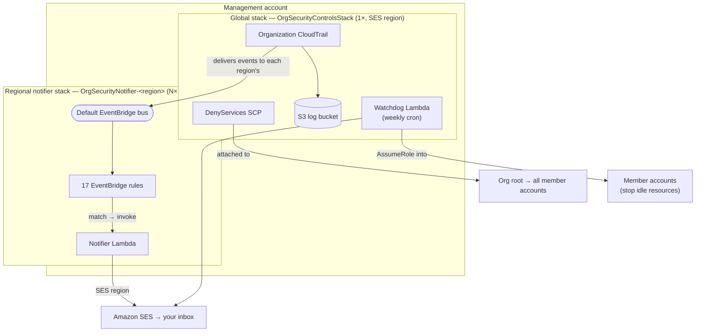

# AWS Organization Security Controls

A CDK app that secures your AWS Organization with preventive guardrails, real-time alerts, and automated cost control — deployed in minutes from the management account.

## Why Use This

Managing security across multiple AWS accounts is tedious. This project gives you:

- **Preventive controls** — Service Control Policies block dangerous actions before they happen (root usage, unapproved regions, oversized instances, CloudTrail tampering)
- **Real-time alerts** — 17 EventBridge rules catch security-relevant events and send you an email within minutes (root logins, MFA changes, security group modifications, cost anomalies)
- **Automated cost enforcement** — A weekly Lambda scans all member accounts and stops idle resources (EC2, RDS, ECS tasks, unused EIPs)
- **One-command deploy** — A single `npm run deploy` sets up everything: SCPs, organization trail, event rules, and both Lambda functions, across all regions

All of this is infrastructure-as-code, versionable, and customizable through a simple `cdk.json` config.

## Architecture



**Why the split:** the SCP and the organization trail are org-wide singletons, so they live in one global stack. CloudTrail delivers each event to the default EventBridge bus **in the region where the activity happened** — so the rules + Notifier must exist in every region to catch regional events (security-group changes, CloudTrail tampering, etc.). All Notifier Lambdas send through a single SES region, so email identities are verified only once.

## Deploy scope — what runs where

| Resource | Scope | Regions | Notes |
|----------|-------|---------|-------|
| DenyServices SCP | **Global** | 1 (org-wide effect) | Singleton; org policy names must be unique |
| Organization CloudTrail | **Global** | 1 (multi-region trail) | Captures all accounts + all regions |
| S3 log bucket | **Global** | 1 | `RETAIN` on destroy |
| Watchdog Lambda + schedule | **Global** | 1 | Weekly cross-account cost sweep |
| 17 EventBridge rules | **Regional** | N (all regions) | One copy per region's default bus |
| Notifier Lambda | **Regional** | N (all regions) | Sends via the single SES region |
| SES verified identities | **Global** | 1 (SES region) | Verify sender + recipient once |
| CDK bootstrap stack | **Regional** | N (all regions) | One-off, via `bin/bootstrap-all-regions.sh` |

## What Gets Deployed

The app is split into two kinds of stacks:

- **One global stack** (`OrgSecurityControlsStack`) — SCP, organization trail, watchdog. Deployed once, in the SES region.
- **One regional notifier stack per region** (`OrgSecurityNotifier-<region>`) — EventBridge rules + notifier Lambda. CloudTrail delivers events to the default bus in the region where the activity happened, so the notifier is deployed to every region to catch regional events (e.g. security-group changes, CloudTrail tampering) wherever they occur.

| Component | Stack | What It Does |
|-----------|-------|-------------|
| **DenyServices SCP** | Global | 7 deny statements attached to the org root — blocks unapproved regions, oversized instances, CloudTrail tampering, root usage, IAM user creation, unauthorized Bedrock access |
| **Organization CloudTrail** | Global | Management events from all accounts → S3 bucket + default EventBridge bus |
| **Watchdog Lambda** | Global | Runs every Friday, assumes into member accounts, stops waste, emails a report |
| **17 EventBridge Rules** | Regional (×N) | Pattern-match security events → Notifier Lambda |
| **Notifier Lambda** | Regional (×N) | Formats event details into readable emails via SES (all regions send through one SES region) |

## Security Events Monitored

The Notifier Lambda sends you an email when any of these happen across your organization:

- Root console login
- Console login without MFA
- Failed login attempts
- CloudTrail logging disabled/deleted/modified
- IAM user or access key created
- Login profile attached to a user
- MFA device deactivated
- SSO user created
- Security group ingress rule added
- Cost anomaly detected
- Budget threshold breached
- IAM Access Analyzer finding
- Any AWS Organizations API call

## Configuration

All behavior is customizable through two files:

**`cdk.json`** (committed, shared config):

```json
{
  "context": {
    "approvedRegions": ["eu-west-1", "eu-west-3", "eu-central-1", "us-east-1"],
    "allowedRdsClasses": ["db.t4g.micro", "db.t4g.small"],
    "allowedEc2Types": ["t4g.nano", "t4g.micro"],
    "bedrockAllowedPrincipals": [],
    "watchdogScheduleHour": 18
  }
}
```

**`.env`** (not committed, account-specific):

```bash
CDK_DEFAULT_ACCOUNT=123456789012
CDK_DEFAULT_REGION=us-east-1   # region for the global stack
SES_REGION=us-east-1           # region all notifier Lambdas send mail through (defaults to CDK_DEFAULT_REGION)
ORGANIZATION_ID=o-xxxxxxxxxx
ORGANIZATION_ROOT_ID=r-xxxx
RECIPIENT_EMAIL=security@example.com
SENDER_EMAIL=noreply@example.com
```

> The set of regions the notifier deploys to is defined by `notifierRegions` in
> `bin/app.ts` (all commercial regions by default). Override it at deploy time with
> `-c notifierRegions='["us-east-1","eu-west-1"]'` if you only operate in a few regions.

## Getting Started

### Prerequisites

One-time setup from the management account:

```bash
# Enable SCPs on the organization root
aws organizations enable-policy-type \
  --root-id <YOUR_ROOT_ID> \
  --policy-type SERVICE_CONTROL_POLICY

# Enable CloudTrail trusted service access
aws organizations enable-aws-service-access \
  --service-principal cloudtrail.amazonaws.com

# Verify SES sender and recipient emails in the SES region (SES_REGION, e.g. us-east-1)
# All notifier Lambdas send through this single region, so you only verify once.
aws ses verify-email-identity --email-address <SENDER_EMAIL>
aws ses verify-email-identity --email-address <RECIPIENT_EMAIL>

# One-off: bootstrap CDK in every region the notifier deploys into.
# The notifier stack is deployed to all regions (events are recorded in the region
# where the activity happens), so each region needs a CDK bootstrap stack once.
AWS_PROFILE=default bash bin/bootstrap-all-regions.sh
```

### Deploy

```bash
# Clone and install
npm install

# Configure your environment
cp .env.sample .env
# Edit .env with your account values

# Deploy the global stack (SCP + org trail + watchdog) and all regional
# notifier stacks in one command. Regional stacks deploy in parallel after
# the global stack, so a full redeploy stays fast.
AWS_PROFILE=default CDK_DEFAULT_REGION=us-east-1 npm run deploy
```

That's it. SCPs, trail, rules, and Lambdas are all live.

> **Note on architecture:** the stack is split into a single global stack
> (`OrgSecurityControlsStack` — SCP, organization trail, watchdog) and one
> regional notifier stack per region (`OrgSecurityNotifier-<region>` —
> EventBridge rules + notifier Lambda). The `npm run deploy` script runs
> `cdk deploy --all --concurrency 10 --require-approval never`; each regional
> stack depends on the global stack, so ordering is automatic.

## When a New Account Joins the Organization

Most controls apply immediately. The Watchdog Lambda is the only component that requires a cross-account role.

### What applies automatically

| Component | New Account Coverage |
|-----------|---------------------|
| DenyServices SCP | ✅ Inherited from org root |
| Organization CloudTrail | ✅ Captures all accounts |
| EventBridge notifications | ✅ Events flow from org trail |
| Watchdog Lambda | ⚠️ Requires cross-account role |

### Accounts created via AWS Organizations

Nothing to do. AWS automatically provisions `OrganizationAccountAccessRole` in accounts created with `CreateAccount`.

### Accounts invited to the organization

The role is **not** created automatically. After the account accepts the invitation, create it manually:

```bash
# Run from the NEW MEMBER ACCOUNT

# Create trust policy
cat > /tmp/trust-policy.json << 'EOF'
{
  "Version": "2012-10-17",
  "Statement": [{
    "Effect": "Allow",
    "Principal": { "AWS": "arn:aws:iam::<MANAGEMENT_ACCOUNT_ID>:root" },
    "Action": "sts:AssumeRole"
  }]
}
EOF

# Create the role
aws iam create-role \
  --role-name OrganizationAccountAccessRole \
  --assume-role-policy-document file:///tmp/trust-policy.json

# Attach permissions (scope down as needed)
aws iam attach-role-policy \
  --role-name OrganizationAccountAccessRole \
  --policy-arn arn:aws:iam::aws:policy/AdministratorAccess
```

The new account will be picked up on the next Friday Watchdog run.

## Testing

### Quick smoke test

```bash
# Run the included smoke test
bash test/smoke-test.sh
```

### What to expect

- **EventBridge alerts**: Create a security group with an ingress rule → email arrives within 1–5 minutes
- **Watchdog**: Invoke the Lambda manually → execution report email received
- **SCPs**: From a member account, try a denied action (e.g., launch in an unapproved region) → AccessDenied

### Unit tests

```bash
npm test
```

## Limits and Considerations

- **SCP size limit**: The DenyServices policy must stay under 5,120 characters (validated at synthesis time)
- **SES sandbox**: If your account is in the SES sandbox, both sender and recipient emails must be verified
- **Watchdog timeout**: The Lambda has a 15-minute timeout — large organizations with many accounts/regions may need the schedule split
- **Region coverage**: The Watchdog only scans regions listed in `approvedRegions`
- **Break-glass**: If you need to bypass CloudTrail protection, set a `breakGlassRoleArn` in the SCP engine props

## Project Structure

```
├── bin/
│   ├── app.ts                      CDK app entry point (global stack + per-region notifiers)
│   └── bootstrap-all-regions.sh    One-off: cdk bootstrap across all notifier regions
├── lib/
│   ├── org-security-controls-stack.ts   Global stack (SCP, trail, watchdog)
│   ├── regional-notifier-stack.ts       Regional stack (EventBridge rules + notifier Lambda)
│   ├── scp-engine.ts / org-trail.ts / eventbridge-rules.ts   Constructs
├── lambda/
│   ├── notifier/     Email formatting and delivery
│   └── watchdog/     Weekly cost-control enforcement
│       └── actions/  Per-service action modules (compute, database, network, logs)
├── test/             Unit, property-based, and integration tests
├── cdk.json          Policy parameters
└── .env.sample       Template for account-specific config
```

## License

MIT
